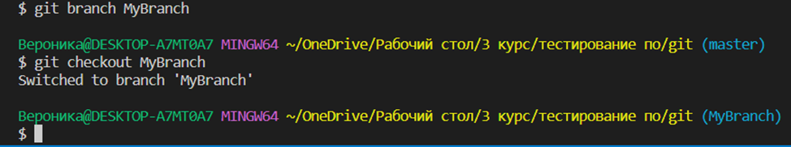

# **Инструкция по работе с Git и VS Code**

Доброго времени суток, друг!
Стало быть, ты в начале своего увлекательного пути, раз заинтересовался работой в Git. Это прекрасно!
Тебе крупно повезло, ведь здесь собрана та самая база, которая поможет тебе познать основы работы с Git и VS Code!

## Подготовка рабочего места
Разумеется без установки соответствующих программ, ничего не получится. Так что убедитесь, что на вашем устройстве уже установлены Visual Studio Code и Git Bash, а так же не забудьте пройти регистрацию на GitHub.

В начале работы вам необходимо создать папку, это можно сделать любым удобным и привычным способом.
Далее, открываем терминал и начинаем работу уже непосредстенно в нем. 
Для этого запустите Visual Studio Code, зажмите сочетание клавиш "ctrl + shift + p". В появившемся диалоговом окне нажимаете на "Terminal: Select Default Profile" и выбираете пункт "Git Bash".

Если вдруг вы впервые столкнулись с подобной средой разработки, рекомендуем вам посмотреть на просторах интернета, какие плагины помогут вам в вашей дальнейшей работе :)

В первую очередь, необходимо войти в аккаунт. Это можно сделать при помощи следующих команд:
* git config --global user.name "имя_пользователя" - задаём имя пользователя для коммитов.
* git config --global user.email "адрес_электронной_почты" - задаём email для коммитов.

* git version - эта команда покажет версию Git, которая установлена.
## Инициализация репозитория
Чтобы инициализировать наш репозиторий и посмотреть его статус, в терминале вводим команды:
* git init - инициализация репозитория.
* git status - отображает состояние директории, на данный момент нам показывает, что ни один файл мало того не отслеживается Git, но и не создан вовсе.

Давайте теперь создадим любой файл.
Вот что выдаст нам терминал после ввода команды, показывающей статус директории:

Как вы уже догадались, файл существует, но не отслеживается Git. Давайте же исправим этот момент. 
Так как у нас файл всего один мы с чистой совестью и спокойной душой вводим команду:
* git add . - добавляет все файлы в репозиторий.
И для наглядности проверяем статус директории:

Но в вашем перспективном будущем, будет явно не один файл и чтобы добавить конкретный объект используем:
* git add <filename> - добавить файл в репозиторий.

## Работа с коммитами
Давайте теперь наглядно посмотрим, как через терминал занести изменения на Git. Эти самые изменения и называются коммитами :)
* git commit -m "text" - записывает изменения в репозиторий.
* git log - отображает историю коммитов с изменениями.

Вот вам еще несколько команд для работы с коммитами:
* git log --graph - отображает дерево зависимостей для всех коммитов.
* git log --oneline - отображает коммиты в одну строку (только хэш и сообщение).
* git log --oneline --stat - отображает статистику изменённых файлов для каждого коммита, при этом в одну строку.
* git diff - отображает разницу между любыми двумя Git деревьями (коммиты, например).
* git commit -a -m "text" - записывает изменения в репозиторий и автоматически добавляет все измененные файлы в индекс.
* git commit --amend -m "text" - записывает изменения последнего коммита.

## Работа с удаленным репозиторием
Теперь перейдем к самому интересному)
Вам необходимо скопировать ссылку на ваш репозиторий, если вы взглянете на команды ниже, то станет сразу понятно, для чего это нужно :)  
* git remote add <название> <ссылка_репозитория> - добавляет удалённый репозиторий и присваивает ему имя.
* git push <название> <имя_ветки> - отправляет изменения (имя ветки) на сервер.
Для наглядности:

## Ветки в Git
Ну на этом этапе все просто.
* git branch <имя_ветки> - создаёт новую ветку.
* git checkout <имя_ветки> - переходит на заданную ветку.
* git merge <имя_ветки> - слияет указанную ветку с основной.

Вот и все) Все максимально просто!
### Желаем успехов в ваших дальнейших проектах и любых начинаниях!
